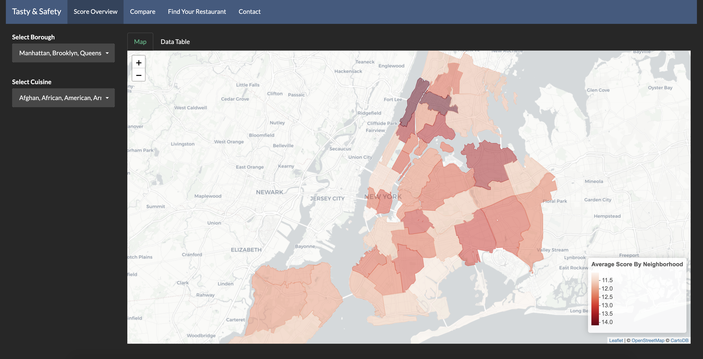

# Tasty-and-Safety-Restaurant-Safety-Information-App
Food safety themed app using Shinyapp

### [Project Description](doc/project2_desc.md)

In this second project of GR5243 Applied Data Science, we develop a version 2.0 of an *Exploratory Data Analysis and Visualization* shiny app on a topic of your choice using [NYC Open Data](https://opendata.cityofnewyork.us/) or U.S. government open data released on the [data.gov](https://data.gov/) website. See [Project 2 Description](doc/project2_desc.md) for more details.  

The **learning goals** for this project is:

- business intelligence for data science
- study legacy codes and further development
- data cleaning
- data visualization
- systems development/design life cycle
- shiny app/shiny server

## Tasty and Safety
Term: Fall 2019

+ Team 6
+ **Projec title**: Tasty and Safety: Restaurant Safety Information App 
+ **Team members**:
	+ Chen, Luyue
	+ He, Chongyu
	+ Kravitz, Adam
	+ Wu, Wenyue
	+ Zhuo, Na

+ **Project link**: https://lovelydoggy.shinyapps.io/Final_presentation/  
+ **Project summary**: The App is a tool to connect users to New York City restaurants' food safety inpsection results. In this app, users could explore the food-safety landscape among different boroughs, cuisines, and neighborhoods from various angles such as violations, scores, and grades. The whole app contains three overview tabs: Map Overview, Comparison and Restuarant Lookup.    

	+ Map Overview  
	The first part gives users a customizable heatmap with an overview of average inspection score based on selected filters.
        
	+ Comparation  
	This part allows a more nuanced comparison between selections based on various filters. "Top vialotion" shows most-frequent violations of restaurants. "Inspection scores" and "Inspection grades" shows the breakdowns of scores and grades restaurants received at the most recent inspection. 

	+ Restuarant Lookup  
	The final part "Restaurant Lookup" would allow users to lookup restaurants according to cusine type, borough and grades. Users can click on search results to identify their restaurants on the map and see further detailed information on the "Detail" tab. 
